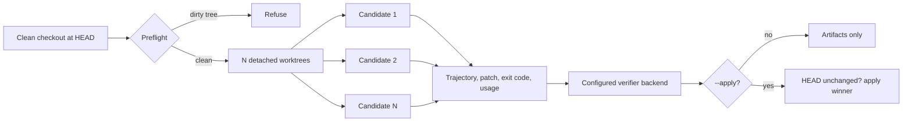

# OMP Best Of

[](https://github.com/wolfiesch/omp-best-of/actions/workflows/ci.yml)
[](LICENSE)

Run several OMP-powered isolated candidate agents on the same task in detached git worktrees, rank their complete trajectories with either [LLM-as-a-Verifier](https://github.com/llm-as-a-verifier/llm-as-a-verifier) or an OMP subscription-backed sampled judge, and optionally apply the selected patch.

```text
/best-of --n 5 --apply Fix the failing authentication test
```

## Why this exists

Sampling several solutions raises the chance that at least one is correct, but selecting among them remains a separate problem. This plugin provides OMP orchestration, pluggable verifier selection, inspectable artifacts, and opt-in patch application. Selection quality depends on the candidates, criteria, verifier model, and endpoint.

The default logprob backend uses the tournament algorithm from Kwok et al. through the upstream `llm-verifier` Python package rather than a reimplementation. The sampled backend is a separate conventional pairwise judge, not the paper's continuous-score method. Published benchmark results belong to the upstream authors; this plugin has not established equivalent reliability.

## How it works



1. **Preflight.** Resolve the repository root, refuse a dirty working tree, and record `HEAD`.
2. **Fan out.** Create one detached `git worktree` per candidate at that exact commit, under a temporary directory.
3. **Generate.** Run one headless Oh My Pi session per worktree, concurrently, in JSON event mode with extensions and sessions disabled.
4. **Collect.** Parse each transcript, stage everything in the worktree, and capture a binary-safe patch against `HEAD`.
5. **Rank.** Use either the upstream continuous-logprob tournament or a seeded sampled pairwise round robin over the eligible trajectories.
6. **Select.** Apply the winner only when `--apply` is given, and only when the parent `HEAD` and status are still unchanged.
7. **Clean.** Remove every worktree and prune, whether the run succeeded or failed. Artifacts are always kept.

A candidate that exits non-zero, or whose patch cannot be captured, is excluded before ranking. With a single surviving candidate the verifier is skipped and reported as such.

## Requirements

| Requirement | Notes |
| --- | --- |
| Oh My Pi 17 or newer | Provides the extension API, the `omp` binary, and credentials |
| Bun 1.3 or newer | Runtime for the plugin and its CLI |
| Git | Worktree isolation and patch application |
| `uv` | Required only by the logprob backend; runs the pinned `llm-verifier==0.2.0` sidecar |
| A verifier route in omp | Logprob mode needs a score-capable API endpoint; sampled mode can invoke an OMP subscription model |
| Clean working tree | Enforced before any candidate starts |

Candidates inherit the calling session's model and thinking level, so `/best-of` runs
what you are already running; `--model` and `--thinking` override that. Verification is
separate and defaults to the `logprob` backend with `deepseek/deepseek-v4-flash`.

The default logprob backend resolves credentials through omp's model registry. DeepSeek V4
Flash is the default because its native score-tag path is known to work. Other endpoints
must prove the constrained-prefill behavior required by `llm-verifier==0.2.0`; the plugin
sends a one-token capability probe before generation and refuses endpoints that ignore or
reject that contract. Compatible self-hosted vLLM and SGLang endpoints are eligible.

The sampled backend invokes the named verifier through the `omp` binary instead of a
provider API client. This supports subscription-authenticated routes such as
`openai-codex/gpt-5.6-luna` without API credits:

```text
/best-of --model openai-codex/gpt-5.6-luna --verifier-backend sampled \
  --verifier-model openai-codex/gpt-5.6-luna Fix the failing test
```

Sampled mode runs one live judgment before candidate generation to prove the OMP route
works. It does not receive token logprobs and must not be presented as a reproduction of
LLM-as-a-Verifier's continuous scoring.

## Install

From the marketplace:

```bash
omp plugin marketplace add wolfiesch/omp-best-of
omp plugin install best-of@omp-best-of
```

From a local clone:

```bash
git clone https://github.com/wolfiesch/omp-best-of.git
cd omp-best-of
bun install
omp plugin link .
```

Restart Oh My Pi after installing, then confirm the plugin is healthy:

```bash
omp plugin doctor omp-best-of
```

## Usage

Inside a session, selection only, leaving the checkout untouched:

```text
/best-of --n 5 Refactor the parser and preserve its public API
```

Inside a session, applying the winning patch:

```text
/best-of --n 3 --apply Fix the failing authentication test
```

As a standalone command, useful from scripts and CI:

```bash
omp-best-of --n 3 --apply -- "Fix the failing authentication test"
```

The standalone form writes progress to stderr and a JSON summary to stdout, so `runId`, `winner`, `applied`, `artifactDir`, `durationMs`, `candidateUsage`, and `verifier` can be piped straight into another tool. `winner` is one based, matching the labels shown during the run.

### Options

| Flag | Default | Description |
| --- | --- | --- |
| `--n <2-8>` | `3` | Number of isolated candidates |
| `--model <provider/model>` | session model | Candidate model; every model slot in the child agent is pinned to it |
| `--verifier-model <model>` | `deepseek/deepseek-v4-flash` | Verifier model selector; an API-scoring model for `logprob`, or an OMP model for `sampled` |
| `--verifier-backend <mode>` | `logprob` | `logprob` for upstream LLM-as-a-Verifier or `sampled` for an OMP-backed pairwise judge |
| `--evaluations <n>` | `1` | Repeated logprob evaluations or complete sampled pairwise rounds |
| `--pivots <n>` | `2` | Pivots in the logprob tournament; ignored by sampled mode |
| `--max-time <duration>` | `20m` | Per-candidate wall-clock limit, such as `90s`, `20m`, `2h` |
| `--thinking <level>` | session level | Candidate thinking level, such as `off`, `low`, `high`; trades candidate quality for cost |
| `--seed <n>` | `0` | Tournament seed |
| `--apply` | off | Apply the winning patch to the parent checkout |
| `--select-only` | on | Rank and keep artifacts without touching the checkout |
| `--no-verify` | off | Generate and retain candidate artifacts without ranking; cannot be combined with `--apply` |
| `--help` | | Print usage |

### Environment

| Variable | Purpose |
| --- | --- |
| `OMP_BEST_OF_PYTHON` | Run the bridge with an existing interpreter instead of `uv`. That interpreter must already provide `llm-verifier` |
| `OMP_BEST_OF_VERIFIER_BRIDGE` | Override the bridge script path |
| `OMP_BEST_OF_OMP_BIN` | Override the `omp` binary used for candidates and sampled judgments |
| `PI_CODING_AGENT_DIR` | Moves the artifact root along with the Oh My Pi agent directory |

## Verification mechanics

Two verifier backends are available:

- **`logprob` (default).** The upstream framework computes continuous expected scores from
  score-token distributions, repeats evaluations to reduce variance, decomposes the rubric,
  and uses its probabilistic pivot tournament. This is the paper's method and requires a
  compatible scoring endpoint.
- **`sampled`.** OMP asks the selected subscription model for a pairwise probability for
  every unordered candidate pair. Candidate orientation and call order are seeded, up to
  four comparisons run concurrently, and pairwise-majority wins determine the ranking.
  A candidate's weakest head-to-head probability breaks majority cycles, followed by
  expected win probability. Semantic contract violations are decisive, and each claimed bug
  must cite an exact supporting code path; validation quality is only a tie-breaker.
  `--evaluations` repeats the complete round robin. Results are cached after every call.

Both backends use the same three criteria:

| Criterion | Question |
| --- | --- |
| Requirements | Does the resulting repository state satisfy every explicit requirement in the task? |
| Correctness | Do the implementation and observed tool outputs support that the change is correct, including important edge cases? |
| Verification | Did the agent run relevant validation and interpret its results accurately without hiding failures? |

In logprob mode, ranking uses the upstream probabilistic pivot tournament rather than all
pairs. A cyclic ring pass gives every candidate one comparison, then leaders become pivots.
Sampled mode deliberately uses all pairs, requiring $N(N-1)/2$ calls per evaluation.

The logprob verifier receives each rendered trajectory, final patch, and process result.
Sampled judgments receive the patch and process result but omit the agent-authored transcript,
which prevents validation narration from outweighing implementation semantics.

## Cost and latency model

Total work is `N` generation runs plus verification. Two properties matter when budgeting:

- Logprob verification is comparison heavy and can itself consume substantial reasoning
  tokens. Sampled verification uses $N(N-1)/2$ subscription calls per evaluation: six calls
  for four candidates and 28 for eight.
- Candidates run concurrently. Sampled comparisons also run up to four at a time, so wall
  clock is lower than the sum of call durations.

Every run reports candidate and verifier token usage. Sampled-mode `reported_cost_usd` is
OMP runtime accounting, not an incremental bill for subscription-routed usage. Subscription
plans still impose provider usage limits.

For reference, the upstream project reports the following on Terminal-Bench 2.1 with DeepSeek V4 Flash for both generation and verification:

| Configuration | Random pass@1 | Verifier-selected | Oracle |
| --- | --- | --- | --- |
| Best-of-3 | 79.4% | 86.5% | 92.1% |
| Best-of-5 | 78.7% | 88.0% | 96.6% |

Those results belong to the upstream authors and have not been reproduced here. Nothing in this repository should be read as an independent benchmark.

### Measured on this repository

`bench/` holds a selection benchmark that pays for a candidate pool once, labels every
candidate with a hidden oracle, and reports random pass@1, verifier-selected, and oracle
pass@N over the same pool. `bench/RESULTS.md` records what it measured here: a 4-candidate
pool on a small task cost about $0.05 to $0.08 including verification and took 95s to 693s,
23 of 24 candidates passed their oracle so most pools were saturated, and on the single
discriminating pool the verifier ranked the failing candidate first. Those runs use small
single-function fixtures, so they test the harness and the cost model rather than the
method's published accuracy.

## Artifacts

Every run writes a durable directory, by default under `~/.omp/agent/best-of/runs/<run-id>/`:

```text
<run-id>/
  candidate-1/
    events.jsonl      raw Oh My Pi JSON event stream
    trajectory.md     rendered transcript
    changes.patch     binary-safe patch against the run HEAD
    stderr.log        candidate stderr and patch capture errors
  candidate-2/ ...
  verifier-cache.json verifier score cache for the run
  winner.patch        written only when --apply succeeds
  result.json         winner, ranking, scores, usage, timings
```

Losing candidates are kept, so a rejected patch can still be inspected, replayed, or applied by hand.

## Safety model

- Each candidate gets a detached worktree at the recorded commit and is instructed not to modify the parent. This prevents repository patch collisions; it is not an OS sandbox or host-isolation boundary.
- The run refuses to start from a dirty working tree.
- Selection is the default. Without `--apply`, patches stay in the artifact directory.
- Before applying, the parent `HEAD` and status must be byte-identical to preflight, otherwise the run reports that the winner was not applied.
- Applying uses `git apply --check` before the real apply, so a conflicting patch fails without partial writes.
- Candidate agents do not commit, and the plugin never pushes, tags, or rewrites history.
- Candidate agents run as headless OMP subprocesses in `yolo` approval mode with sessions and extensions disabled. They do not appear in Agent Hub or native subagent lifecycle surfaces, and they can technically access the host filesystem and network.

## Development

```bash
bun install
bun run check          # type check plus tests
bun run smoke:verifier # live verifier round trip through omp credentials, needs network
bun run smoke:verifier <provider/model> # same, against another verifier you have credentials for
bun bench/run.ts --help # selection benchmark, spends money on model calls
```

`bun run check` is offline. The smoke script makes real verifier calls and is intended for confirming credentials and the Python bridge end to end.

Layout:

```text
src/extension.ts   Oh My Pi command registration, progress widget, result reporting
src/runner.ts      worktrees, candidate execution, ranking, patch application
src/model.ts       verifier endpoint and credential resolution through omp's registry
src/verifier.ts    JSON contract with the Python bridge
src/transcript.ts  JSON event stream parsing and usage aggregation
src/args.ts        flags, defaults, criteria, help text
src/cli.ts         standalone entry point
bench/run.ts       selection benchmark, pool storage, scorecards
bench/oracle.ts    fixture materialization and hidden-oracle labeling
bench/tasks/       benchmark fixtures: prompt, repo, oracle, reference solution
```

See [CONTRIBUTING.md](CONTRIBUTING.md) before opening a pull request.

## Attribution

The verification algorithm and the Python package are the work of Kwok et al.

- Paper: [LLM-as-a-Verifier: A General-Purpose Verification Framework](https://arxiv.org/abs/2607.05391)
- Code: [llm-as-a-verifier/llm-as-a-verifier](https://github.com/llm-as-a-verifier/llm-as-a-verifier), MIT licensed

```bibtex
@misc{kwok2026llmasaverifier,
  title  = {LLM-as-a-Verifier: A General-Purpose Verification Framework},
  author = {Jacky Kwok and Shulu Li and Pranav Atreya and Yuejiang Liu and Yixing Jiang and Chelsea Finn and Marco Pavone and Ion Stoica and Azalia Mirhoseini},
  year   = {2026},
  eprint = {2607.05391},
  archivePrefix = {arXiv},
  primaryClass  = {cs.AI}
}
```

## License

[MIT](LICENSE)
