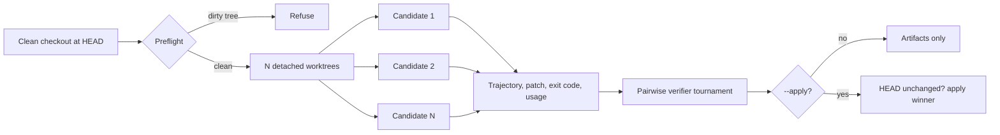

# OMP Best Of

[](https://github.com/wolfiesch/omp-best-of/actions/workflows/ci.yml)
[](LICENSE)

Run several [Oh My Pi](https://github.com/can1357/oh-my-pi) coding agents on the same task in isolated git worktrees, rank their complete trajectories with [LLM-as-a-Verifier](https://github.com/llm-as-a-verifier/llm-as-a-verifier), and apply only the patch that wins.

```text
/best-of --n 5 --apply Fix the failing authentication test
```

## Why this exists

Sampling several solutions raises the chance that at least one of them is correct. In production you rarely have a hidden test suite to tell you which one it is, so that headroom is normally wasted. A calibrated verifier converts it into a single answer, which is what makes repeated sampling from an inexpensive model competitive with one expensive single-shot run.

This repository is the Oh My Pi orchestration layer: isolation, patch safety, artifacts, and cost accounting. The scoring algorithm is the published one from Kwok et al. and runs through the upstream `llm-verifier` Python package rather than a reimplementation.

## How it works



1. **Preflight.** Resolve the repository root, refuse a dirty working tree, and record `HEAD`.
2. **Fan out.** Create one detached `git worktree` per candidate at that exact commit, under a temporary directory.
3. **Generate.** Run one headless Oh My Pi session per worktree, concurrently, in JSON event mode with extensions and sessions disabled.
4. **Collect.** Parse each transcript, stage everything in the worktree, and capture a binary-safe patch against `HEAD`.
5. **Rank.** Pass the eligible candidates, each as trajectory plus final patch plus process result, to `llm-verifier`.
6. **Select.** Apply the winner only when `--apply` is given, and only when the parent `HEAD` and status are still unchanged.
7. **Clean.** Remove every worktree and prune, whether the run succeeded or failed. Artifacts are always kept.

A candidate that exits non-zero, or whose patch cannot be captured, is excluded before ranking. With a single surviving candidate the verifier is skipped and reported as such.

## Requirements

| Requirement | Notes |
| --- | --- |
| Oh My Pi 17 or newer | Provides the extension API, the `omp` binary, and credentials |
| Bun 1.3 or newer | Runtime for the plugin and its CLI |
| Git | Worktree isolation and patch application |
| `uv` | Runs the pinned `llm-verifier==0.2.0` sidecar |
| A verifier credential in omp | Any provider omp can authenticate that serves an OpenAI-compatible chat-completions endpoint, such as `omp token deepseek` |
| Clean working tree | Enforced before any candidate starts |

Candidates inherit the calling session's model and thinking level, so `/best-of` runs
what you are already running; `--model` and `--thinking` override that. The verifier is
separate and defaults to `deepseek/deepseek-v4-flash`.

Verifier credentials come from omp's own model registry, not from a plugin-specific API
key, so an OAuth-backed provider works with no extra setup. The selector is resolved the
way omp's auth gateway resolves it: a provider-qualified id wins outright, and a bare id
such as `deepseek-v4-flash`, which eight catalog providers serve, picks the first provider
omp holds a credential for. Resolution happens before the first candidate starts, so a
missing credential or a model whose dialect cannot return token logprobs fails before any
generation is paid for.

## Install

From the marketplace:

```bash
omp plugin marketplace add wolfiesch/omp-best-of
omp plugin install best-of@omp-best-of
```

From a local clone:

```bash
git clone https://github.com/wolfiesch/omp-best-of.git
cd omp-best-of
bun install
omp plugin link .
```

Restart Oh My Pi after installing, then confirm the plugin is healthy:

```bash
omp plugin doctor omp-best-of
```

## Usage

Inside a session, selection only, leaving the checkout untouched:

```text
/best-of --n 5 Refactor the parser and preserve its public API
```

Inside a session, applying the winning patch:

```text
/best-of --n 3 --apply Fix the failing authentication test
```

As a standalone command, useful from scripts and CI:

```bash
omp-best-of --n 3 --apply -- "Fix the failing authentication test"
```

The standalone form writes progress to stderr and a JSON summary to stdout, so `runId`, `winner`, `applied`, `artifactDir`, `durationMs`, `candidateUsage`, and `verifier` can be piped straight into another tool. `winner` is one based, matching the labels shown during the run.

### Options

| Flag | Default | Description |
| --- | --- | --- |
| `--n <2-8>` | `3` | Number of isolated candidates |
| `--model <provider/model>` | session model | Candidate model; every model slot in the child agent is pinned to it |
| `--verifier-model <model>` | `deepseek/deepseek-v4-flash` | Verifier model, resolved through omp's catalog and credentials |
| `--evaluations <n>` | `1` | Repeated verifier evaluations per criterion |
| `--pivots <n>` | `2` | Pivots in the probabilistic tournament |
| `--max-time <duration>` | `20m` | Per-candidate wall-clock limit, such as `90s`, `20m`, `2h` |
| `--thinking <level>` | session level | Candidate thinking level, such as `off`, `low`, `high`; trades candidate quality for cost |
| `--seed <n>` | `0` | Tournament seed |
| `--apply` | off | Apply the winning patch to the parent checkout |
| `--select-only` | on | Rank and keep artifacts without touching the checkout |
| `--help` | | Print usage |

### Environment

| Variable | Purpose |
| --- | --- |
| `OMP_BEST_OF_PYTHON` | Run the bridge with an existing interpreter instead of `uv`. That interpreter must already provide `llm-verifier` |
| `OMP_BEST_OF_VERIFIER_BRIDGE` | Override the bridge script path |
| `OMP_BEST_OF_OMP_BIN` | Override the `omp` binary used for candidates |
| `PI_CODING_AGENT_DIR` | Moves the artifact root along with the Oh My Pi agent directory |

## Verification mechanics

The upstream framework replaces a single discrete judge score with three scaling axes, and this plugin uses all three:

- **Continuous scoring.** The score is the expectation over the distribution of score tokens rather than the argmax token, which removes the tie rates that make discrete judges unusable for ranking.
- **Repeated evaluation.** `--evaluations` averages independent passes to cut variance.
- **Criteria decomposition.** Instead of one compound question, three orthogonal criteria are scored and averaged:

| Criterion | Question |
| --- | --- |
| Requirements | Does the resulting repository state satisfy every explicit requirement in the task? |
| Correctness | Do the implementation and observed tool outputs support that the change is correct, including important edge cases? |
| Verification | Did the agent run relevant validation and interpret its results accurately without hiding failures? |

Ranking uses the upstream probabilistic pivot tournament rather than all pairs. A cyclic ring pass gives every candidate one comparison and neutralizes position bias, then the leaders become pivots and the remaining budget is spent comparing against them. Comparison count therefore grows with `N` times pivots instead of `N` squared, which is what keeps larger candidate pools affordable.

Each candidate is shown to the verifier as its rendered trajectory, its final patch, and its process result, so failures visible only in tool output still influence the score.

## Cost and latency model

Total cost is `N` generation runs plus verification. Two properties matter when budgeting:

- Verification is comparison heavy. It reads long trajectory pairs, which prefix caching absorbs well, but at default DeepSeek reasoning effort it also thinks at length, so its output tokens are not negligible. On the small fixtures in `bench/`, verification was 25 to 51 percent of run cost.
- Candidates run concurrently, so wall-clock time is closer to the slowest candidate than to the sum of all of them.

Every run reports its own numbers instead of relying on estimates. The result includes per-candidate requests, input, output, cache read, cache write, reasoning tokens, and cost, plus verifier calls, input, output, reasoning tokens, and the measured cache hit rate. Use those fields for your own comparisons; they are the only cost numbers this project claims.

For reference, the upstream project reports the following on Terminal-Bench 2.1 with DeepSeek V4 Flash for both generation and verification:

| Configuration | Random pass@1 | Verifier-selected | Oracle |
| --- | --- | --- | --- |
| Best-of-3 | 79.4% | 86.5% | 92.1% |
| Best-of-5 | 78.7% | 88.0% | 96.6% |

Those results belong to the upstream authors and have not been reproduced here. Nothing in this repository should be read as an independent benchmark.

### Measured on this repository

`bench/` holds a selection benchmark that pays for a candidate pool once, labels every
candidate with a hidden oracle, and reports random pass@1, verifier-selected, and oracle
pass@N over the same pool. `bench/RESULTS.md` records what it measured here: a 4-candidate
pool on a small task cost about $0.05 to $0.08 including verification and took 95s to 693s,
23 of 24 candidates passed their oracle so most pools were saturated, and on the single
discriminating pool the verifier ranked the failing candidate first. Those runs use small
single-function fixtures, so they test the harness and the cost model rather than the
method's published accuracy.

## Artifacts

Every run writes a durable directory, by default under `~/.omp/agent/best-of/runs/<run-id>/`:

```text
<run-id>/
  candidate-1/
    events.jsonl      raw Oh My Pi JSON event stream
    trajectory.md     rendered transcript
    changes.patch     binary-safe patch against the run HEAD
    stderr.log        candidate stderr and patch capture errors
  candidate-2/ ...
  verifier-cache.json verifier score cache for the run
  winner.patch        written only when --apply succeeds
  result.json         winner, ranking, scores, usage, timings
```

Losing candidates are kept, so a rejected patch can still be inspected, replayed, or applied by hand.

## Safety model

- Candidates never see the parent checkout. Each one gets a detached worktree at the recorded commit.
- The run refuses to start from a dirty working tree.
- Selection is the default. Without `--apply`, patches stay in the artifact directory.
- Before applying, the parent `HEAD` and status must be byte-identical to preflight, otherwise the run reports that the winner was not applied.
- Applying uses `git apply --check` before the real apply, so a conflicting patch fails without partial writes.
- Candidate agents do not commit, and the plugin never pushes, tags, or rewrites history.
- Candidate sessions run in Oh My Pi's `yolo` approval mode inside their disposable worktrees. That is deliberate, and it is the reason isolation is mandatory rather than optional.

## Development

```bash
bun install
bun run check          # type check plus tests
bun run smoke:verifier # live verifier round trip through omp credentials, needs network
bun run smoke:verifier <provider/model> # same, against another verifier you have credentials for
bun bench/run.ts --help # selection benchmark, spends money on model calls
```

`bun run check` is offline. The smoke script makes real verifier calls and is intended for confirming credentials and the Python bridge end to end.

Layout:

```text
src/extension.ts   Oh My Pi command registration, progress widget, result reporting
src/runner.ts      worktrees, candidate execution, ranking, patch application
src/model.ts       verifier endpoint and credential resolution through omp's registry
src/verifier.ts    JSON contract with the Python bridge
src/transcript.ts  JSON event stream parsing and usage aggregation
src/args.ts        flags, defaults, criteria, help text
src/cli.ts         standalone entry point
bench/run.ts       selection benchmark, pool storage, scorecards
bench/oracle.ts    fixture materialization and hidden-oracle labeling
bench/tasks/       benchmark fixtures: prompt, repo, oracle, reference solution
```

See [CONTRIBUTING.md](CONTRIBUTING.md) before opening a pull request.

## Attribution

The verification algorithm and the Python package are the work of Kwok et al.

- Paper: [LLM-as-a-Verifier: A General-Purpose Verification Framework](https://arxiv.org/abs/2607.05391)
- Code: [llm-as-a-verifier/llm-as-a-verifier](https://github.com/llm-as-a-verifier/llm-as-a-verifier), MIT licensed

```bibtex
@misc{kwok2026llmasaverifier,
  title  = {LLM-as-a-Verifier: A General-Purpose Verification Framework},
  author = {Jacky Kwok and Shulu Li and Pranav Atreya and Yuejiang Liu and Yixing Jiang and Chelsea Finn and Marco Pavone and Ion Stoica and Azalia Mirhoseini},
  year   = {2026},
  eprint = {2607.05391},
  archivePrefix = {arXiv},
  primaryClass  = {cs.AI}
}
```

## License

[MIT](LICENSE)
